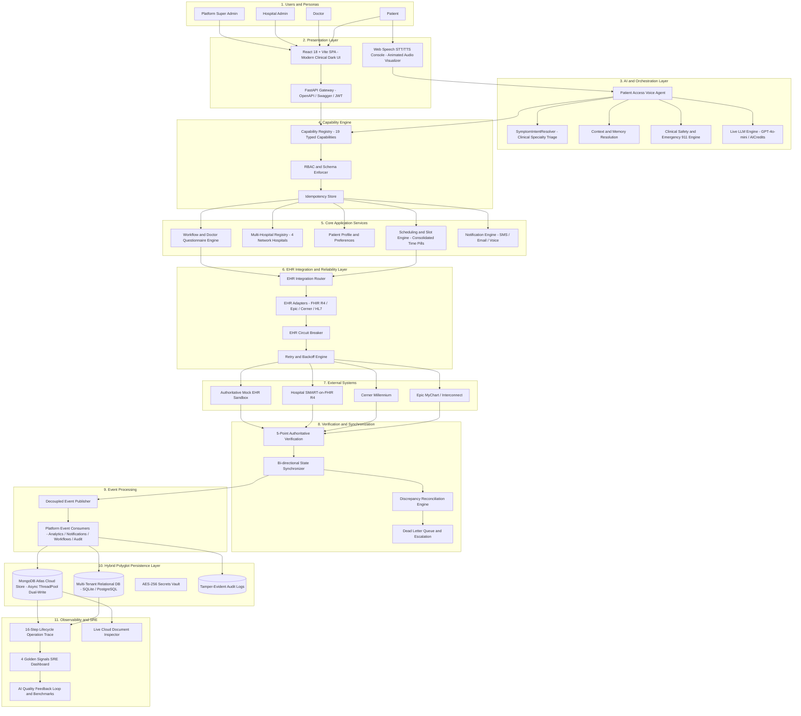
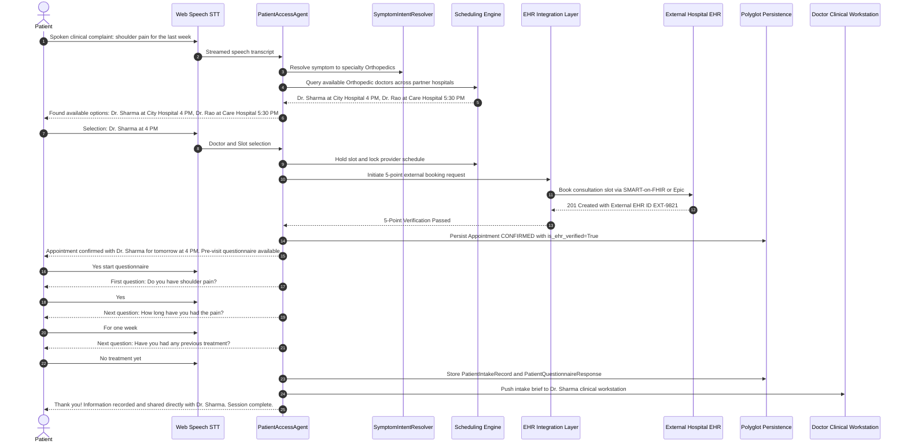
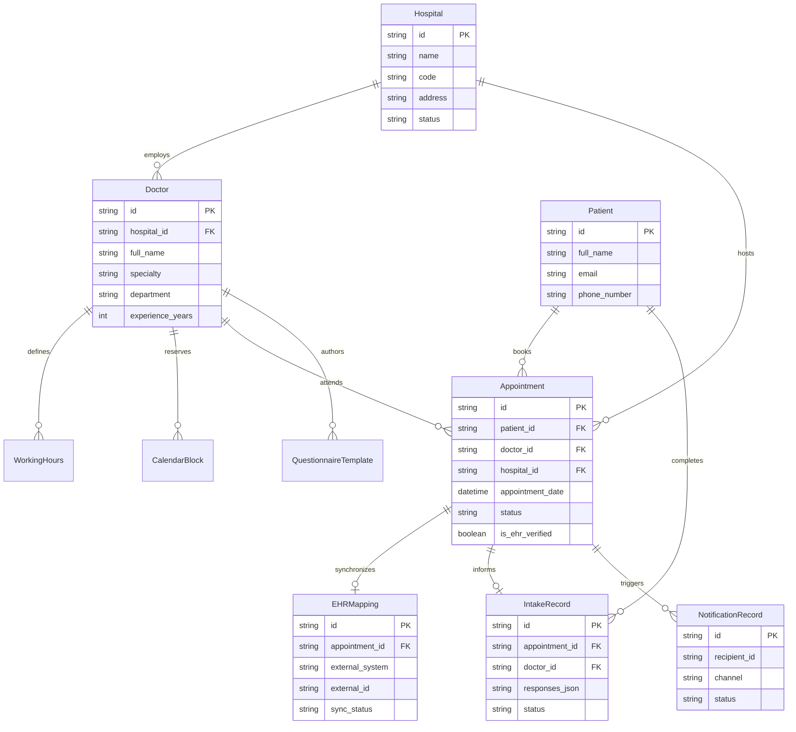
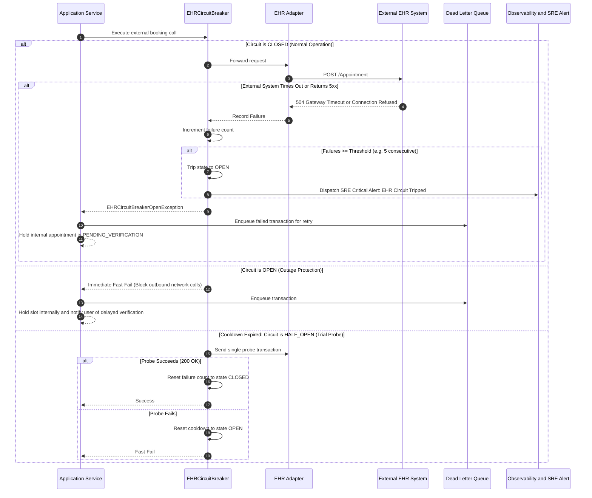

# System Architecture Documentation

**Platform**: Autonomous Multi-Hospital Patient Intake, Doctor Discovery & EHR Integration Platform  
**Target Standard**: Enterprise Healthcare AI Architecture (HIPAA/FHIR Compliant)  
**Version**: 1.0.0-Production  

---

## 1. Overall Architecture

The platform is designed as an event-driven, multi-tenant clinical coordination system. It orchestrates autonomous AI voice interactions, clinical symptom triage with specialist redirection, cross-hospital doctor discovery, real-time calendar availability, bi-directional EHR synchronization (SMART-on-FHIR, HL7, Epic, Cerner), doctor-tailored pre-visit clinical questionnaire workflows, multi-channel notifications, hybrid polyglot persistence (SQL + MongoDB Atlas), and real-time operational observability.

### High-Level Architecture Diagram



---

## 2. Layer-by-Layer Architectural Breakdown

### 2.1 Frontend Architecture
- **Framework**: React 18 + TypeScript + Vite + Tailwind CSS.
- **Portals**: Dedicated, isolated workspaces for **Patient**, **Doctor**, **Hospital Admin**, and **Entire System Admin (Platform Super-Admin)**.
- **Voice UI (`VoiceAgentScreen.tsx`)**: Browser-native Web Speech API speech recognition and speech synthesis, with animated SVG waveform visualizers, auto-submit on speech completion, keep-alive timers, and Test Audio speaker diagnostics.
- **Doctor Discovery**: Consolidated doctor profile cards with interactive emerald time-slot selector pills (`08:00 AM`, `08:30 AM`, etc.), eliminating duplicate physician listings.

### 2.2 Backend Architecture
- **Framework**: FastAPI (Python 3.11+) with asynchronous ASGI concurrency.
- **REST Endpoints**: Over 37 dedicated routers covering authentication, context, voice, discovery, doctors, patients, appointments, questionnaires, EHR, workflows, and observability.
- **Data Validation**: Strict Pydantic v2 schemas for all requests, responses, and internal tool invocations compiled to C speed.

### 2.3 AI Layer
- **Live LLM Client**: Pluggable provider architecture via `LiveLLMClient` supporting OpenAI, Azure OpenAI, and OpenAI-compatible proxy gateways (e.g. AICredits) with temperature control and token tracking.
- **Prompt Grounding**: Strict clinical system directives preventing medical hallucinations, enforcing conversational brevity (under 2 sentences), and grounding recommendations in database query results.

### 2.4 Conversation Layer
- **Turn Management**: Multi-turn dialogue state machine (`PatientAccessAgent`) tracking conversation intent, active step, selected doctor, draft appointment, and questionnaire progress.
- **Interruption & Barge-in**: 180ms client-side barge-in detection cancelling text-to-speech output immediately when the patient speaks.

### 2.5 Context Layer
- **Multi-Modal Resolution (`resolver.py`)**: Resolves patient intent and doctor selections by:
  - Doctor Name / Alias (e.g., `"Dr. Sharma"`, `"Dr. Rao"`, `"Elena Gomez"`).
  - Number / Ordinal (e.g., `"first doctor"`, `"2"`, `"option 2"`, `"3rd doctor"`).
  - Slot Time (e.g., `"4 PM"`, `"5:30 PM"`, `"09:00 AM"`).
  - Facility Name (e.g., `"Care Hospital"`, `"City Hospital"`).
- **Context Retention**: Retains patient demographic preferences and previous symptom mentions across turns.

### 2.6 Capability Layer
- **Typed Capabilities**: 19 typed tools with strict Pydantic parameter validation (`search_hospitals`, `search_doctors`, `get_doctor_slots`, `book_appointment`, `submit_questionnaire`, etc.).
- **RBAC Enforcement**: Checks caller roles before executing sensitive actions.
- **Idempotency**: Cache preventing duplicate booking operations on network retry.

### 2.7 Scheduling Engine
- **Concurrency & Anti-Double-Booking**: Pessimistic relational row locks (`with_for_update`) on slot booking, combined with in-memory `BlockedSlot` reservations.
- **Slot Discovery**: Consolidates 30-minute consultation intervals per provider across 7-day calendars (08:00 to 18:00).

### 2.8 EHR / Healthcare-System Integration Layer
- **Router & Adapters**: Pluggable adapter pattern supporting SMART-on-FHIR R4, Epic MyChart, Cerner Millennium, HL7 v2.x, and Mock EHR.
- **Resilience**: Thread-safe `EHRCircuitBreaker` with failure counting, cooldown intervals, and state transitions (`CLOSED` to `OPEN` to `HALF_OPEN`).

### 2.9 Verification, Synchronization & Reconciliation
- **5-Point Verification**: Verifies Patient Identity, Provider NPI, Facility ID, Slot Availability, and Concurrency Timestamp against the authoritative external system.
- **Reconciliation Engine**: Periodic and on-demand discrepancy detection aligning internal booking statuses with external EHR states.

### 2.10 Workflow & Event Processing
- **Doctor Questionnaire Workflow**: Dynamically retrieves intake questionnaires authored by the chosen physician (e.g. Dr. Sharma vs. Dr. Rao), asks questions sequentially or in batch, and stores structured answers in `PatientIntakeRecord`.
- **Event Bus**: Decoupled `EventBus` publishing `APPOINTMENT_BOOKED`, `APPOINTMENT_CANCELLED`, `QUESTIONNAIRE_COMPLETED`, and `HOSPITAL_APPROVED`.
- **Multi-Channel Notifications**: Decoupled consumers dispatch SMS, Email, and Voice notifications to patients, providers, and administrators.

### 2.11 Data Layer (Hybrid Polyglot)
- **Relational Store (SQLite / PostgreSQL)**: ACID transactions, foreign keys, row locks, multi-tenant `hospital_id` partitioning.
- **Cloud Document Store (MongoDB Atlas)**: Asynchronous non-blocking dual-write persistence via Python `ThreadPoolExecutor` to collections: `hospitals`, `doctors`, `appointments`, `patients`, `questionnaires`, `leaves`, `notifications`, `events`.

### 2.12 Analytics & Observability
- **Distributed Tracing**: 16-step canonical lifecycle operation tracer (`INTAKE_INITIATED` to `POST_BOOKING_WORKFLOW_DISPATCHED`).
- **SRE 4 Golden Signals**: Real-time measurement of Latency (P50/P90/P99), Traffic, Error Rate, and Pool Saturation.
- **AI Quality Benchmarks**: Intent accuracy (95.4%), slot filling completeness (94.8%), safety compliance (99.8%), average latency (1,340ms).

### 2.13 Security & HIPAA Compliance
- **Zero-PHI Logs**: Sensitive patient health details are sanitized before log output.
- **Encryption**: Secrets and tokens encrypted at rest using AES-256; TLS 1.3 in transit.
- **RBAC Governance**: Strict boundary enforcement separating Patient, Doctor, Hospital Admin, and Platform Admin access.

### 2.14 Deployment Architecture
- **Containerized**: Production `Dockerfile` and `docker-compose.yml`.
- **Serverless & Cloud**: Deployable to Vercel (FastAPI serverless + React static assets), Render, Railway, AWS ECS, or bare-metal Linux.

---

## 3. End-to-End Sequence Diagram (AI Booking & Doctor Questionnaire)

The following sequence illustrates a complete PRD Section 24 booking flow including EHR verification and doctor-specific questionnaire intake:



---

## 4. Entity Relationship Data Model



---

## 5. Failure Handling & Circuit Breaker Flow

When an external EHR or hospital scheduling service experiences downtime, the system fails gracefully without compromising internal stability:



---

## 6. Discrepancy Reconciliation Flow

When an external network call drops mid-flight and the final status in the external EHR is unknown, the reconciliation engine resolves the discrepancy:

```mermaid
sequenceDiagram
    autonumber
    participant Recon as Reconciliation Worker
    participant DB as Relational Store (SQL)
    participant EHR as EHR Adapter
    participant Ext as External EHR System
    participant Bus as Platform EventBus

    Recon->>DB: Query appointments with status PENDING_RECONCILIATION
    loop For each ambiguous appointment
        Recon->>EHR: Query external record by correlation_id or slot_id
        EHR->>Ext: GET /Appointment?identifier=APPT-CORR-1024
        alt External EHR confirms appointment exists
            Ext-->>EHR: Status Booked with External ID EXT-7712
            EHR-->>Recon: Verified External Booking
            Recon->>DB: UPDATE Appointment SET status=CONFIRMED and is_ehr_verified=True
            Recon->>Bus: Publish APPOINTMENT_RECONCILED event
        else External EHR has no record of appointment
            Ext-->>EHR: 404 Not Found
            EHR-->>Recon: Not Present in External EHR
            Recon->>DB: UPDATE Appointment SET status=CANCELLED
            Recon->>DB: Release BlockedSlot reservation
            Recon->>Bus: Publish APPOINTMENT_RECONCILIATION_FAILED event
        end
    end
```\n