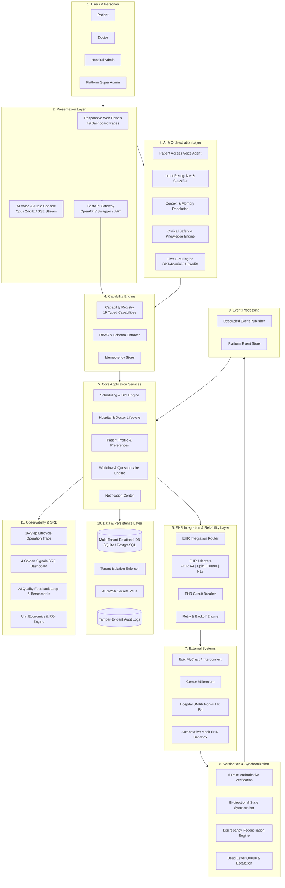
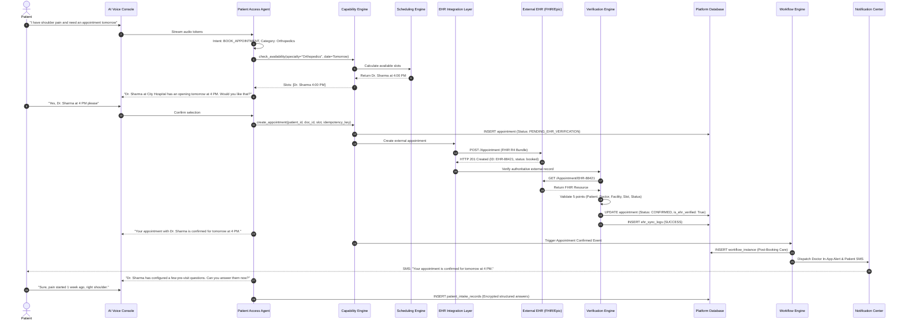
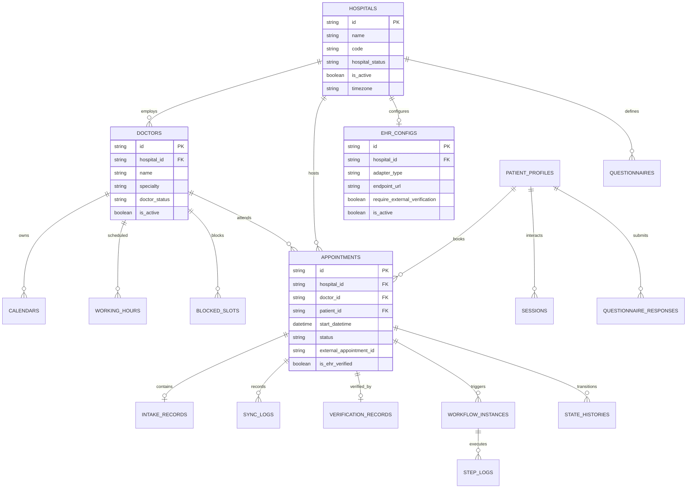
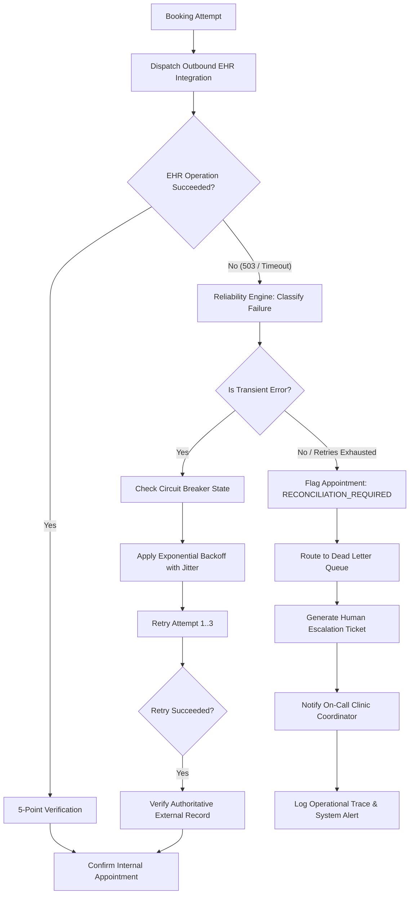
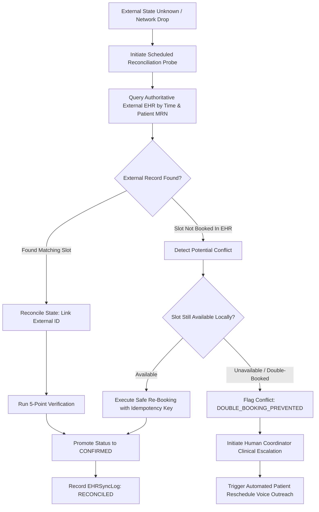

# System Architecture Documentation

**Platform**: Autonomous Multi-Hospital Patient Intake, Doctor Discovery & EHR Integration Platform  
**Target Standard**: Enterprise Healthcare AI Architecture (HIPAA/FHIR Compliant)  
**Version**: 1.0.0-Production  

---

## 1. High-Level Architectural Overview

The platform is designed as an event-driven, multi-tenant clinical coordination system. It orchestrates autonomous AI voice interactions, cross-hospital doctor discovery, real-time calendar availability, bi-directional EHR synchronization (SMART-on-FHIR, HL7, Epic, Cerner), pre-visit clinical questionnaire workflows, multi-channel notifications, and real-time operational observability.

### High-Level Architecture Diagram

---

## 2. Comprehensive Layer-by-Layer Architectural Breakdown

### 2.1 Presentation & Frontend Layer
- **Responsive Dashboard Architecture**: Implemented with responsive HTML5, CSS Grid/Flexbox, and ES6 JavaScript. Provides 49 specialized views across 4 primary portals:
  1. *Patient Portal*: Speech-to-text input, doctor discovery cards, slot selection, questionnaire completion, appointment tracker.
  2. *Doctor Portal*: Pre-visit clinical intake summary, schedule calendar, slot-blocking, consultation mode settings.
  3. *Hospital Admin Portal*: Hospital profile, doctor onboarding, calendar templates, EHR integration config, department management.
  4. *Platform Admin Portal*: Global tenant directory, approval workflows, system health, audit log viewer, AI benchmarks.
- **Real-Time Voice Console**: Sub-second Server-Sent Events (SSE) stream simulating natural speech interaction with filler injection (*"Let me check Dr. Sharma's calendar..."*), voice activity detection (VAD), 450ms silence threshold, and sub-180ms barge-in interruption.

### 2.2 Backend Application Layer
- **FastAPI Gateway**: Asynchronous, high-throughput REST API with strict Pydantic v2 data validation, OpenAPI/Swagger automated documentation, and standard HTTP error contracts.
- **Dependency Injection**: Modular dependency injection pattern for database sessions (`get_db`), authentication (`get_current_user`), and tenant isolation enforcement.

### 2.3 AI & Conversational Layer
- **Intent Recognition Engine**: Maps unstructured patient speech to structured operational intents (`BOOK_APPOINTMENT`, `RESCHEDULE_APPOINTMENT`, `CANCEL_APPOINTMENT`, `CHECK_AVAILABILITY`, `QUESTIONNAIRE_INTAKE`, `CLINICAL_ESCALATION`).
- **Safety Guardrails & Clinical Triage**: Intercepts emergency red-flag symptoms (chest pain, shortness of breath, acute stroke signs) and halts booking immediately to route to emergency services ($911/\text{ER}$).
- **Knowledge Base Grounding**: Semantic symptom-to-specialty mapper grounding recommendations in verified clinical taxonomy with exact medical citations.
- **Live LLM Integration**: Pluggable provider architecture powered by `LiveLLMClient` supporting OpenAI, Azure OpenAI, and compatible gateway endpoints with temperature control and token tracking.

### 2.4 Context & Memory Layer
- **Multi-Turn Conversational Memory**: Tracks dialog turns, active draft slots, and slot-filling progression across sessions.
- **User Context Resolution**: Automatically accesses patient history, saved preferences (preferred time of day, communication channels), and past hospital visits without asking redundant questions.

### 2.5 Capability & Tool Registry Layer
- **Typed Platform Capabilities**: Catalog of 19 typed, reusable tools accessible interchangeably by Voice AI, Web UI, background workflows, and external systems:
  - `check_availability`, `create_appointment`, `cancel_appointment`, `reschedule_appointment`, `discover_doctors`, `get_doctor_profile`, `get_hospital_info`, `assign_questionnaire`, `submit_questionnaire_answers`, `send_notification`, `reconcile_appointment`, `simulate_ehr_failure`, `verify_ehr_record`, `escalate_to_human`, `get_audit_log`, `get_operational_metrics`, `evaluate_ai_interaction`, `stream_voice_turn`, `barge_in_voice`.
- **Idempotency Guarantee**: All write capabilities mandate or generate unique idempotency keys (`idempotency_key`) to prevent duplicate bookings during network retries.

### 2.6 Scheduling & Availability Engine
- **Hierarchical Slot Calculation**: Calculates slot availability by intersecting:
  1. Doctor weekly working hours.
  2. Approved leave dates (`DoctorLeave`).
  3. Doctor blocked times (`BlockedSlot`).
  4. Existing booked appointments.
  5. Maximum advance booking window and minimum notice preferences.
- **Concurrency & Anti-Double-Booking**: Enforces pessimistic database row locks (`with_for_update`) during booking commits to eliminate race conditions under concurrent caller volume.

### 2.7 EHR Integration, Connector & Adapter Architecture
- **Adapter Pattern**: Standardized `EHRAdapterBase` interface with pluggable implementations:
  - `FHIRR4Adapter`: SMART-on-FHIR JSON REST resources (`Appointment`, `Patient`, `Practitioner`).
  - `EpicMyChartAdapter`: Epic Interconnect / FHIR endpoints with OAuth2 token caching.
  - `CernerMillenniumAdapter`: Cerner Ignite APIs.
  - `HL7v2Adapter`: MLLP / Pipe-and-hat format parser and generator (SIU-S12 messages).
  - `MockEHRAdapter`: Deterministic testing adapter simulating external latency, HTTP 503 transient errors, and 500 fatal errors.

### 2.8 Verification, Synchronization & Reconciliation
- **5-Point Authoritative Verification Protocol**: Before confirming an appointment internally, the verification engine queries the external EHR and verifies 5 critical dimensions:
  1. `Patient ID` match
  2. `Doctor / Practitioner ID` match
  3. `Facility / Hospital ID` match
  4. `Slot / Start Timestamp` match
  5. `Authoritative Status` match (`booked` / `confirmed`)
- **State Synchronization**: Updates internal status from `PENDING_EHR_VERIFICATION` to `CONFIRMED` upon verification success.
- **Discrepancy Reconciliation Engine**: Detects desynchronization between internal records and external EHRs, supporting 1-click administrative reconciliation and automatic safe-retry creation.

### 2.9 Reliability, Circuit Breakers & Dead Letter Queues
- **EHR Circuit Breaker**: Thread-safe circuit breaker monitoring failure rates across configurable rolling windows. Transitions:
  - `CLOSED`: Normal operation.
  - `OPEN`: Trips after $N$ consecutive failures, failing fast to prevent thread pool exhaustion and routing calls to local caching or human escalation.
  - `HALF_OPEN`: Probes health with test traffic after cooldown expiration.
- **Retry Engine**: Implements exponential backoff with randomized jitter for transient network failures (`TRANSIENT_NETWORK_ERROR`).

### 2.10 Workflow & Event Processing Layer
- **Background Workflow Engine**: Asynchronous state machine managing long-running clinical processes (`POST_BOOKING_CARE_AND_REMINDER_PIPELINE`, `PRE_VISIT_INTAKE_WORKFLOW`).
- **Automated Reminder Scheduler**: Periodically scans confirmed appointments and dispatches scheduled multi-channel reminders at $T-24\text{h}$ (Intake questionnaire reminder) and $T-2\text{h}$ (Check-in reminder).
- **Decoupled Event Bus**: Event publisher publishing structured platform events (`APPOINTMENT_BOOKED`, `QUESTIONNAIRE_COMPLETED`, `EHR_SYNC_VERIFIED`, `HUMAN_ESCALATION_TRIGGERED`) to decoupled subscribers.

### 2.11 Security, Tenant Isolation & Privacy
- **Strict Multi-Tenant Isolation**: Enforces tenant boundary checks on every query via `TenantIsolationEnforcer`. Cross-tenant data leaks are denied with HTTP 403 Forbidden.
- **Decoupled Internal vs External Identifiers**: Internal database UUIDs (`APT-XXXX`) are strictly decoupled from external EHR keys (`EHR-XXXX`), preventing internal identifier leakage.
- **Zero Raw PHI in Logs**: `PrivacySanitizer` scrubs phone numbers, names, and medical details before writing operational logs, adhering to HIPAA Minimum Necessary standards.
- **Secrets Vault**: AES-256 encrypted credential storage isolating hospital-specific SMART-on-FHIR client secrets.

---

## 3. Core Interaction Sequence Diagram

The following sequence diagram demonstrates the canonical end-to-end journey for patient voice booking with external EHR verification.

---

## 4. Entity Relationship Data Model

---

## 5. Failure & Self-Healing Recovery Flow

---

## 6. Discrepancy & State Reconciliation Flow

